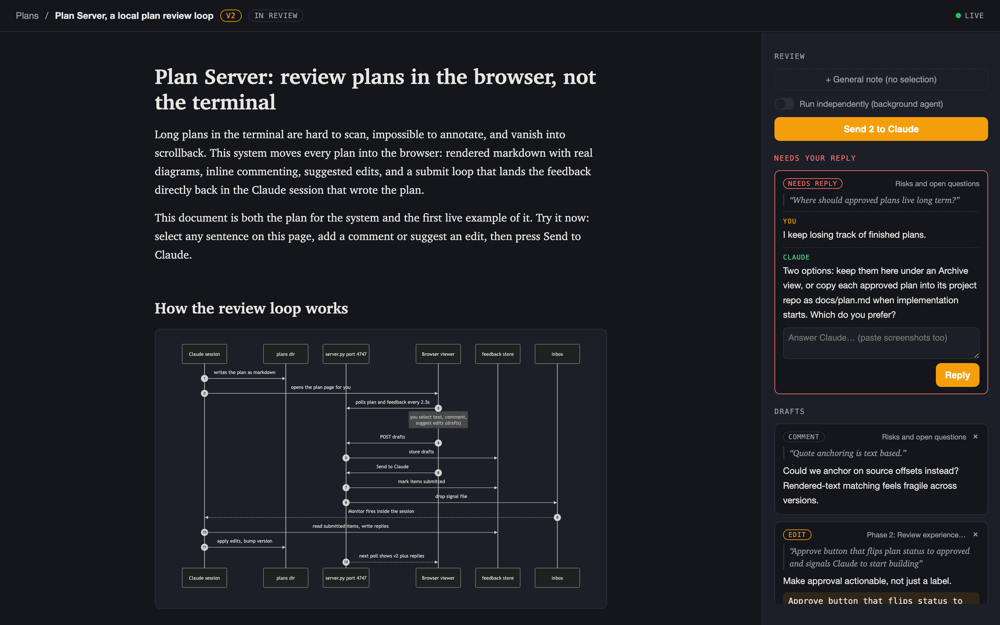

# Plan Server

Google-Docs-style plan review for Claude Code. Plans become versioned markdown pages in your browser, with mermaid diagrams, inline comments, and suggested edits that flow straight back into the Claude session that wrote them.

**Site: [planserver.algofunds.in](https://planserver.algofunds.in)**



## Why not just plan mode?

Standard plan mode prints a wall of text in the terminal and gives you one accept or reject. Plan Server gives you:

- **Real documents, not scrollback.** Plans are versioned markdown files per project workspace, rendered with mermaid diagrams, tables, and phase checklists.
- **Review like a doc, not a diff.** Select any sentence and leave a comment or a suggested edit. Attach screenshots. When Claude has an open question, it becomes a thread on the exact passage.
- **An async loop.** Review at your own pace while Claude keeps working. Batch your notes and press "Send to Claude"; the session picks them up through an inbox watcher without dropping what it was doing. A "Run independently" toggle hands the batch to a background agent so your main session's context stays clean.
- **Plans that live on.** They survive `/clear`, context compaction, and session restarts, and double as a progress board during implementation: checkboxes get ticked, versions bump, status chips flip.
- **Zero dependencies.** One Python stdlib file. marked and mermaid are vendored, so it works offline.

## Quick start

```bash
git clone https://github.com/NikkyAmresh/claude-plan-server ~/.claude/plan-server
ln -s ../plan-server/skill ~/.claude/skills/plan-review
python3 ~/.claude/plan-server/server.py     # http://localhost:4747
```

Then in any Claude Code session, ask for a plan (or say `/plan-review`). Claude writes the plan as markdown, opens it in your browser, and arms a watcher for your feedback. The tracked example plan at `http://localhost:4747/plan/plan-server/v1` is itself a live demo: select a sentence and try it.

Requirements: Python 3.7+, Claude Code. macOS and Linux are supported; the skill's shell snippets are POSIX.

## How it works

```
Claude session ──writes──▶ plans/<workspace>/<slug>.md
       ▲                          │
       │                          ▼
inbox/*.json ◀──on submit── server.py :4747 ◀──poll/POST── browser viewer
       ▲                          │
       └────── feedback/<workspace>/<slug>.json ◀──comments, edits, threads
```

1. Claude writes the plan with front matter (`title`, `version`, `status`, `updated`) and opens the page.
2. You annotate: comments, suggested edits, screenshots, general notes. Drafts collect in a review rail.
3. "Send to Claude" flips drafts to submitted and drops a signal file in `inbox/`.
4. A watcher inside the Claude session claims the signal, applies edits, answers questions, bumps the version. The page polls every 2.5s and shows the new version plus replies.
5. Open questions come back as red "Needs your reply" threads; replying re-submits the item, so the conversation continues on the passage itself.

## Layout

```
server.py        http server: plans, feedback, submit, inbox signals (stdlib only)
viewer.html      review UI: rendering, selection toolbar, review rail, polling
skill/SKILL.md   the Claude Code skill driving the whole workflow
docs/            landing page (GitHub Pages)
plans/<workspace>/*.md       one plan per file, grouped by project workspace
feedback/<workspace>/*.json  comments and edits; draft / submitted / answered / resolved
inbox/*.json                 submit signals claimed by the Claude session
uploads/         screenshots pasted or dropped onto feedback
vendor/          marked.min.js, mermaid.min.js (both MIT)
```

Plans, feedback, inbox, and uploads are gitignored; your review data stays on your machine.

## API

Slugs are workspace-qualified paths: `<workspace>/<name>`.

```
GET  /                        index of plans, grouped by workspace
GET  /plan/<slug>             viewer page
GET  /api/health
GET  /api/plan/<slug>         {slug, meta, markdown, mtime}
GET  /api/feedback/<slug>     {items: [...]}
POST /api/feedback/<slug>     add draft {type, quote, section, prefix, suffix, comment, suggested_text}
POST /api/feedback/<slug>/delete   {id} remove a draft
POST /api/submit/<slug>       {independent?} drafts -> submitted, writes an inbox signal
POST /api/reply/<slug>        {id, text, images?} reply on an answered item, re-submits it
POST /api/upload/<slug>       {data: base64 image data url} -> {url: /uploads/<file>}
```

## Security notes

The server binds `127.0.0.1` only, rejects foreign `Host` headers (DNS rebinding), and has no auth by design: it is a personal, single-reviewer tool. Do not expose it to a network. Feedback text drives an agent with shell access, so treat anything that reaches the inbox as trusted input; if you ever put it behind a tunnel for someone else, add auth and review every batch before Claude processes it.

## License

MIT. Bundles [marked](https://github.com/markedjs/marked) and [mermaid](https://github.com/mermaid-js/mermaid), both MIT licensed.
