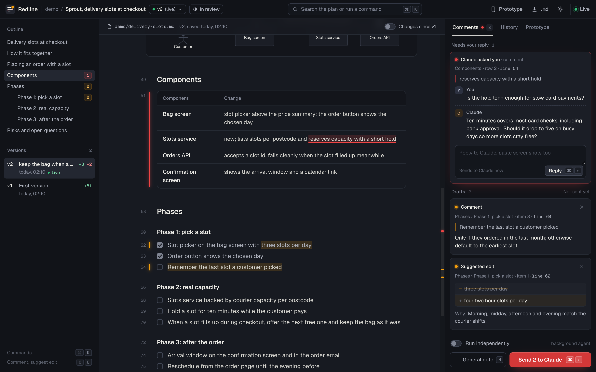
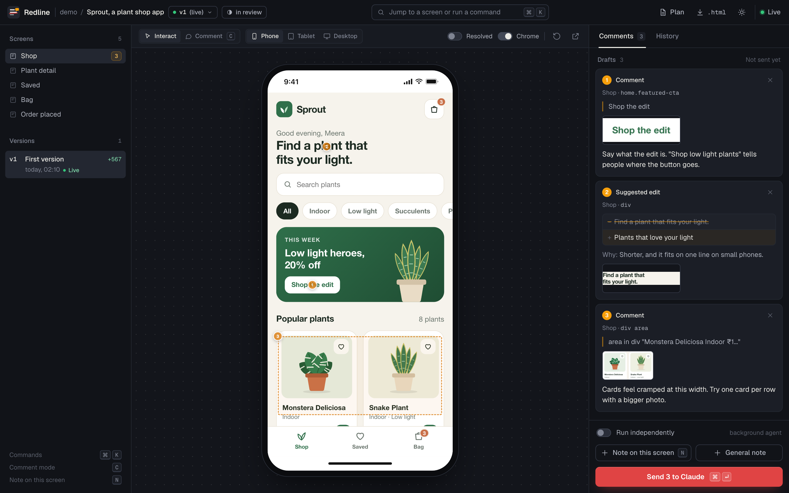
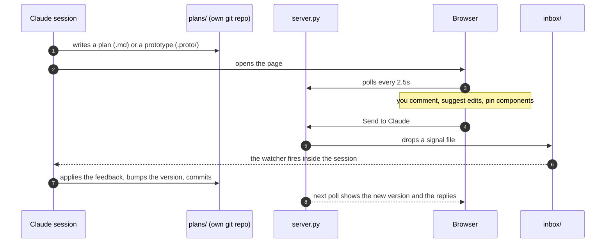

<p align="center"></p>

<h1 align="center">Redline</h1>

<p align="center"><b>Review Claude Code plans like a doc. Redline its prototypes like a design.</b><br>
One Python file, zero dependencies, runs on your machine. <a href="https://redline.algofunds.in">redline.algofunds.in</a></p>



## The problem

Plan mode prints a wall of text in the terminal and gives you one accept or reject. Feedback gets typed from memory ("in step 4...") and scrolls away. Prototypes are worse: you see the problem in a second, then spend minutes describing where it is to an agent that cannot see your screen.

Redline moves both into the browser and sends your feedback straight back to the Claude session that made them.

## Plans

- **Real documents, not scrollback.** Plans are versioned markdown files per project workspace, rendered with mermaid diagrams, tables and phase checklists.
- **Review like a doc, not a diff.** Select any sentence and leave a comment or a suggested edit. Attach screenshots. When Claude has an open question, it becomes a red "Needs your reply" thread on the exact passage.
- **An async loop.** Batch your notes and press "Send to Claude". The session picks them up through an inbox watcher without dropping what it was doing, edits the plan and bumps the version; the page updates live. "Run independently" hands the batch to a background agent so the main session's context stays clean.
- **Plans that live on.** Every version is kept: the dropdown loads any past version, restores it or downloads it as `.md`. Plans survive `/clear`, compaction and restarts, and double as a progress board while Claude implements.

## Prototypes



- **Playable, not a picture.** Ask for a prototype and Claude builds a clickable dummy of any app or website: real screens, fake data, every button does something. Redline shows it in a phone, tablet or desktop frame.
- **Comment on the component.** Press `C` and click anything to pin a comment, or a "Suggest copy" edit for text. Drag a box to comment on an area; hold `Alt` for the exact element. Every pin records the screen, the component id and a screenshot of what you saw.
- **Pins that survive edits.** Pins anchor to `data-rl` component ids, so they stay put when Claude changes the prototype; a pin whose component is gone is flagged as detached.
- **Same loop as plans.** Send the batch, Claude edits the prototype, and it reloads on the same screen as the next version with your pins turned green. History, restore and download (`.html` or `.zip`) included.

## Install

**As a Claude Code plugin** (recommended). In Claude Code:

```
/plugin marketplace add NikkyAmresh/claude-plugins
/plugin install redline@nikkyamresh
```

Redline is listed in [NikkyAmresh/claude-plugins](https://github.com/NikkyAmresh/claude-plugins), a marketplace for all of its author's Claude Code plugins. The plugin bundles the skill and starts the server when a session opens (reusing it if it is already running). Your plans and feedback live in `~/.claude/redline`, outside the plugin, so updates never touch them. Update with `/plugin update redline`.

**From a git clone** (to hack on Redline itself):

```bash
git clone https://github.com/NikkyAmresh/redline ~/.claude/redline
git -C ~/.claude/redline config core.hooksPath hooks     # pre-push guard for local review data
ln -s ../redline/skills/redline ~/.claude/skills/redline
sh ~/.claude/redline/skills/redline/redline.sh start      # prints the URL
```

Use one or the other, not both, or the skill loads twice.

Then in any Claude Code session, ask for a plan or a prototype (or say `/redline`). Claude writes it, opens it in your browser and arms a watcher for your feedback.

Two demos are seeded on first start, and they link to each other (the address is usually `http://127.0.0.1:4747`; see below):

- `/plan/demo/delivery-slots`: a plan for a fictional plant shop. Select a sentence and try it.
- `/proto/demo/sprout-shop`: the playable app that plan describes. Press `C` and click anything.

## One server, a known address

There is only ever one Redline per data directory, and every way of starting it is safe to repeat:

```bash
sh skills/redline/redline.sh start    # start in the background, or report the running one
sh skills/redline/redline.sh url      # print the URL (starting it if needed)
sh skills/redline/redline.sh status   # running or not, and where
sh skills/redline/redline.sh stop
sh skills/redline/redline.sh data     # the data directory
```

- **Identity.** `GET /api/health` answers `{"app": "redline", "version", "pid", "port", "url", "data", ...}`, so nothing mistakes another app on the port for Redline.
- **Single instance.** The running server holds a lock on `<data>/server.lock` for its whole life and records itself in `<data>/server.json`. A crashed server releases the lock, so a stale record never blocks a restart. Two sessions starting at once still end up with one server.
- **Port.** `REDLINE_PORT` if set, else the last port it used (so open tabs keep working), else 4747; if that is taken, the next free one up to 4767. A port counts as taken if anything answers on it over IPv4 or IPv6. Redline listens on `127.0.0.1` and `::1`, so `localhost` and `127.0.0.1` reach the same server.
- **Discovery.** Agents run `redline.sh url`; the plugin's session hook also prints "Redline is running at ..." into each session. `REDLINE_HOME` moves the data directory.

Requirements: Python 3.7+ and Claude Code. macOS and Linux are supported; the skill's shell snippets are POSIX.

## How it works


```mermaid
sequenceDiagram
  autonumber
  participant C as Claude session
  participant P as plans/ (own git repo)
  participant S as server.py
  participant B as Browser
  participant I as inbox/
  C->>P: writes a plan (.md) or a prototype (.proto/)
  C->>B: opens the page
  B->>S: polls every 2.5s
  Note over B: you comment, suggest edits, pin components
  B->>S: Send to Claude
  S->>I: drops a signal file
  I-->>C: the watcher fires inside the session
  C->>P: applies the feedback, bumps the version, commits
  S-->>B: next poll shows the new version and the replies
```

Plans carry front matter (`title`, `version`, `status`, `updated`); prototypes carry the same block in the first HTML comment of `index.html`. Each version bump is a commit in `plans/`, which is its own local git repo, separate from this one.

## Prototype contract

What Claude follows when it builds a prototype (full text in `skills/redline/SKILL.md`, section 7):

- Screens are `[data-rl-screen]` sections with hash routes (`#/cart`, `#/product/3`, `#/cart?state=empty`).
- Every element worth commenting on carries a stable `data-rl` id, on the group and on its parts. Ids never change between versions.
- Everything is playable and fake: in-memory state, seeded dummy data, no real network calls. Prototypes run in a sandboxed iframe with an opaque origin.
- `static/kit.js` is an optional helper (hash router, seeded dummy data, toast, sheet, modal); `examples/demo/sprout-shop.proto/` is a five screen example built with it.

## Layout

```
server.py        http server: plans, prototypes, feedback, submit, inbox signals (stdlib only)
viewer.html      plan review page: rendering, selection toolbar, history
prototype.html   prototype review page: device stage, Comment mode, pins
static/          rail.js and redline.css (review rail shared by both pages),
                 bridge.js (injected into prototypes), kit.js (optional prototype helpers)
skills/redline/  the Claude Code skill (SKILL.md) and redline.sh, the launcher
.claude-plugin/  plugin manifest (listed in the NikkyAmresh/claude-plugins marketplace)
hooks/           hooks.json (plugin: start the server on session start), pre-push (git guard)
examples/demo/   the demo plan and prototype seeded on first start
vendor/          marked, mermaid, html-to-image (all MIT)
docs/            landing page (redline.algofunds.in, static assets on a Cloudflare Worker)

plans/<workspace>/*.md       one plan per file, grouped by project workspace
plans/<workspace>/*.proto/   one prototype per folder, index.html is the entry
feedback/<workspace>/*.json  comments, edits and pins: draft, submitted, answered, resolved
inbox/*.json                 submit signals claimed by the Claude session
uploads/                     screenshots attached to feedback
```

`plans/`, `feedback/`, `inbox/` and `uploads/` are gitignored and stay on your machine; the pre-push hook refuses any commit that contains them.

## API

Slugs are workspace-qualified paths: `<workspace>/<name>`.

```
GET  /                              index of plans and prototypes, grouped by workspace
GET  /plan/<slug>                   plan review page
GET  /proto/<slug>                  prototype review page
GET  /p/<slug>/<path>               prototype files (sandboxed, bridge injected)
GET  /p-at/<sha>/<slug>/<path>      prototype files as of a commit
GET  /api/health                     identity: {app: "redline", version, pid, port, url, data}
GET  /api/plan/<slug>               {slug, meta, markdown, mtime}
GET  /api/proto/<slug>              {slug, kind, meta, mtime}
GET  /api/feedback/<slug>           {items: [...]}
GET  /api/history/<slug>            {commits: [{sha, short, date, subject, version}]}
GET  /api/history-at/<sha>/<slug>   the plan (or prototype meta) as of a commit
GET  /raw/<slug>                    download: .md for a plan, .html or .zip for a prototype
GET  /raw-at/<sha>/<slug>           the same download as of a commit
POST /api/feedback/<slug>           add a draft {type, quote, section, prefix, suffix, comment, suggested_text, kind?, anchor?, images?}
POST /api/feedback/<slug>/delete    {id} remove a draft
POST /api/submit/<slug>             {independent?} drafts become submitted, writes an inbox signal
POST /api/reply/<slug>              {id, text, images?} reply on an answered item, re-submits it
POST /api/upload/<slug>             {data: base64 image data url} returns {url: /uploads/<file>}
POST /api/restore/<sha>/<slug>      restore an old version as a new one
```

## Security notes

The server binds `127.0.0.1` only, rejects foreign `Host` headers (DNS rebinding), and only accepts JSON POSTs from its own origin, so other pages open in your browser cannot plant feedback. Prototypes run sandboxed with an opaque origin (an iframe without `allow-same-origin`, plus a CSP `sandbox` header when opened directly), so prototype code and any CDN script it loads cannot call the API.

There is no auth by design: it is a personal, single-reviewer tool. Do not expose it to a network. Feedback text drives an agent with shell access, so treat anything that reaches the inbox as trusted input; if you ever put it behind a tunnel for someone else, add auth and review every batch before Claude processes it.

## License

MIT. Bundles [marked](https://github.com/markedjs/marked), [mermaid](https://github.com/mermaid-js/mermaid) and [html-to-image](https://github.com/bubkoo/html-to-image), all MIT licensed.
