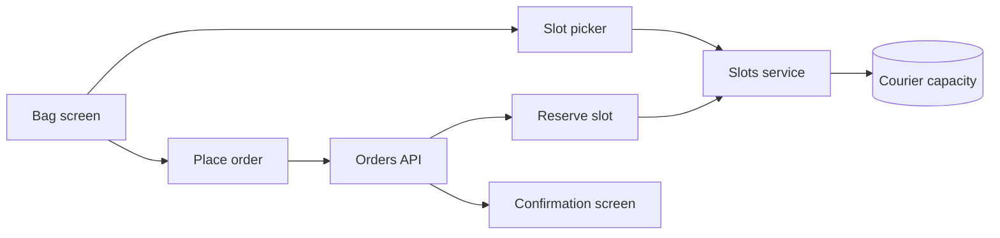
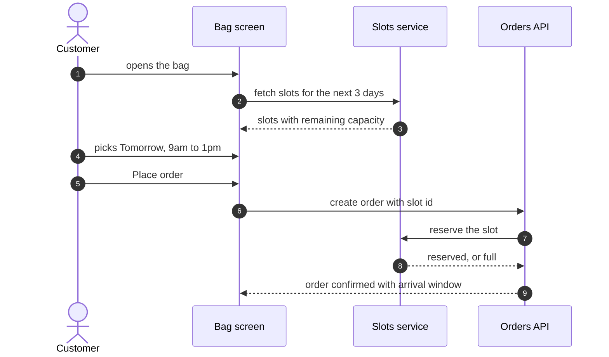

# Delivery slots at checkout

Sprout is a fictional plant shop app; this plan is the demo that ships with Redline. Try it: select any sentence and leave a comment or suggest an edit, then press Send to Claude. The **prototype** button in the header opens the playable app this plan describes.

Plants die in hot delivery vans. Customers asked to pick when an order arrives, so it lands when someone is home to bring it inside. This plan adds a delivery slot picker to the bag, carries the slot through to the order, and shows it on the confirmation screen.

## How it fits together

## Placing an order with a slot

## Components

| Component | Change |
| --- | --- |
| Bag screen | slot picker above the price summary; the order button shows the chosen day |
| Slots service | new; lists slots per postcode and reserves capacity with a short hold |
| Orders API | accepts a slot id, fails cleanly when the slot filled up meanwhile |
| Confirmation screen | shows the arrival window and a calendar link |

## Phases

### Phase 1: pick a slot

- [x] Slot picker on the bag screen with three slots per day
- [x] Order button shows the chosen day
- [ ] Remember the last slot a customer picked

### Phase 2: real capacity

- [ ] Slots service backed by courier capacity per postcode
- [ ] Hold a slot for ten minutes while the customer pays
- [ ] When a slot fills up during checkout, offer the next free one

### Phase 3: after the order

- [ ] Arrival window on the confirmation screen and in the order email
- [ ] Reschedule from the order page until the evening before

## Risks and open questions

- **Slot fills up mid checkout.** The hold covers most cases; the fallback is a clear message and the next free slot, never a silent change.
- **Heat waves.** Should afternoon slots disappear automatically when the forecast is above 35 degrees?
- **Same day delivery.** Out of scope for now; it needs a separate courier contract.
