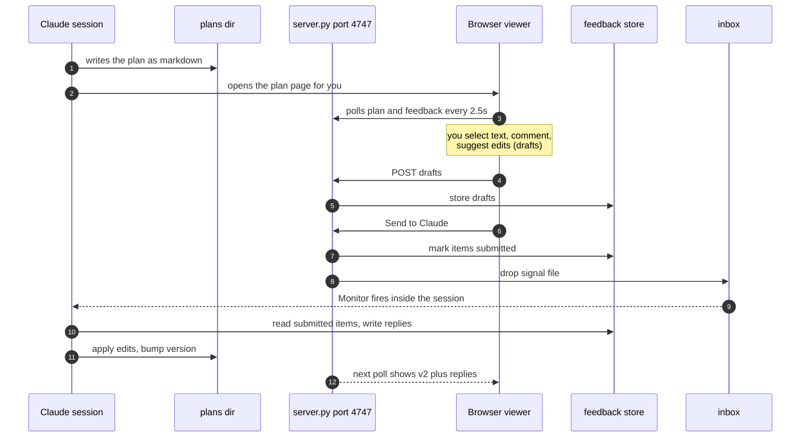
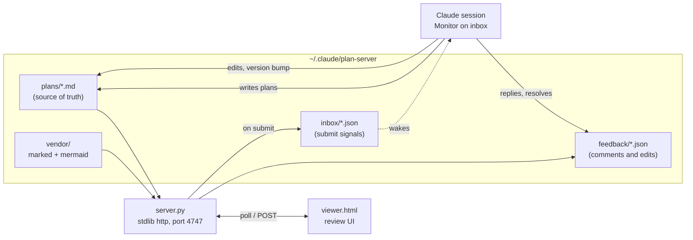
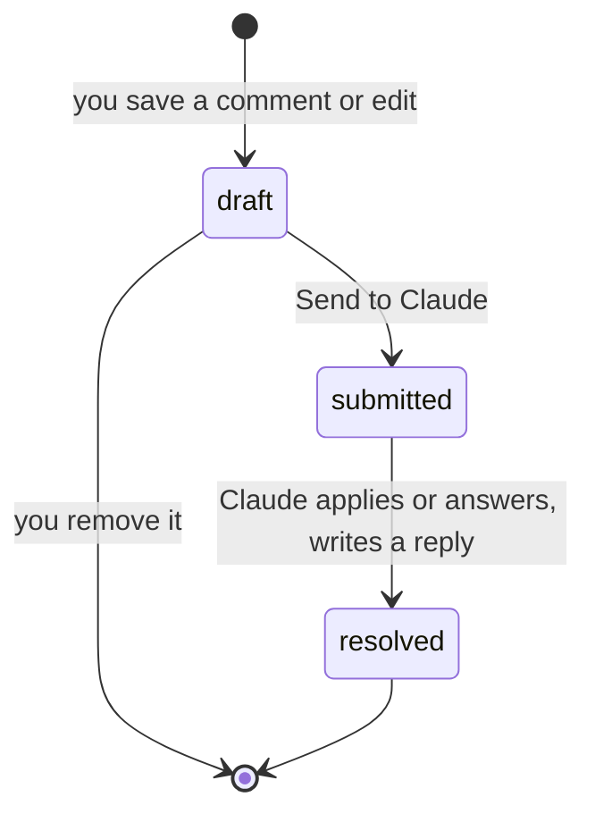

# Redline: review plans in the browser, not the terminal

Long plans in the terminal are hard to scan, impossible to annotate, and vanish into scrollback. This system moves every plan into the browser: rendered markdown with real diagrams, inline commenting, suggested edits, and a submit loop that lands the feedback directly back in the Claude session that wrote the plan.

This document is both the plan for the system and the first live example of it. Try it now: select any sentence on this page, add a comment or suggest an edit, then press Send to Claude.

## How the review loop works

## Components

| Component | Role | Notes |
|---|---|---|
| `server.py` | Serves plans and the viewer, stores feedback, writes inbox signals | Python stdlib only, no dependencies |
| `viewer.html` | Rendered plan, selection toolbar, review rail, polling | Vendored marked and mermaid, works offline |
| `plans/*.md` | One markdown file per plan, front matter carries title, version, status | Claude edits these directly |
| `feedback/*.json` | Every comment and suggested edit, with quote anchors and Claude replies | Statuses: draft, submitted, resolved |
| `inbox/*.json` | Signal files created on submit | A persistent Monitor in the Claude session claims and processes them |
| skill `plan-review` | Teaches future sessions the whole workflow | Any session can serve, watch, and process plans |

## Feedback item lifecycle

Each item stores the selected quote, roughly 40 characters of surrounding context, and the nearest section heading, so Claude can locate the exact spot in the markdown source even after the document changes.

## Phases

### Phase 1: Core loop (shipped today)

- [x] Stdlib Python server on port 4747 with health, plan, feedback and submit APIs
- [x] Viewer with markdown rendering, mermaid diagrams, light and dark theme
- [x] Select to comment, select to suggest an edit, general notes
- [x] Draft rail with remove, batch submit, live status indicator
- [x] Inline highlights for annotated passages, click a card to jump to its passage
- [x] Inbox signal files plus a persistent Monitor in the Claude session
- [x] Claude replies rendered under each resolved item, version bump toast
- [x] `plan-review` skill so every future session knows the workflow

### Phase 2: Review experience (proposed)

- [ ] Show a diff view between plan versions instead of only the latest text
- [ ] Highlight anchoring across formatting boundaries (quotes that span bold or code spans)
- [ ] Approve button that flips plan status to approved and signals Claude to start building
- [ ] Threaded replies, so you can respond to a Claude reply on the same item
- [ ] Keyboard shortcuts: c to comment on selection, e to suggest an edit

### Phase 3: Deeper integration (proposed)

- [ ] Phase checklists that Claude ticks live while implementing, page becomes a progress board
- [ ] Link plan items to git commits once a project repo exists
- [ ] Archive view for completed plans
- [ ] Multiple concurrent plans with an activity feed on the index page

## Risks and open questions

1. **Quote anchoring is text based.** If the same sentence appears twice, the highlight lands on the first occurrence. The stored prefix and suffix let Claude disambiguate when applying edits, but the on page highlight is best effort.
2. **One reviewer at a time.** The server is bound to localhost with no auth; that is intentional for a personal tool. Opening it to a network would need auth first.
3. **Feedback while no session is watching.** Submissions still land in `inbox/` and survive; the next session that runs the `plan-review` skill will pick them up. Is that acceptable, or should submits also trigger a notification?
4. **Where should approved plans live long term?** They could stay here, or be copied into the project repo they describe once implementation starts.
